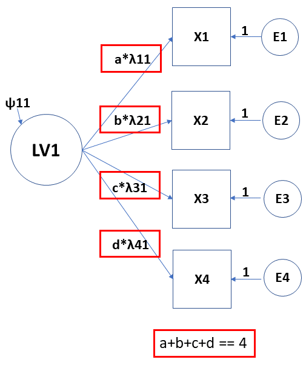
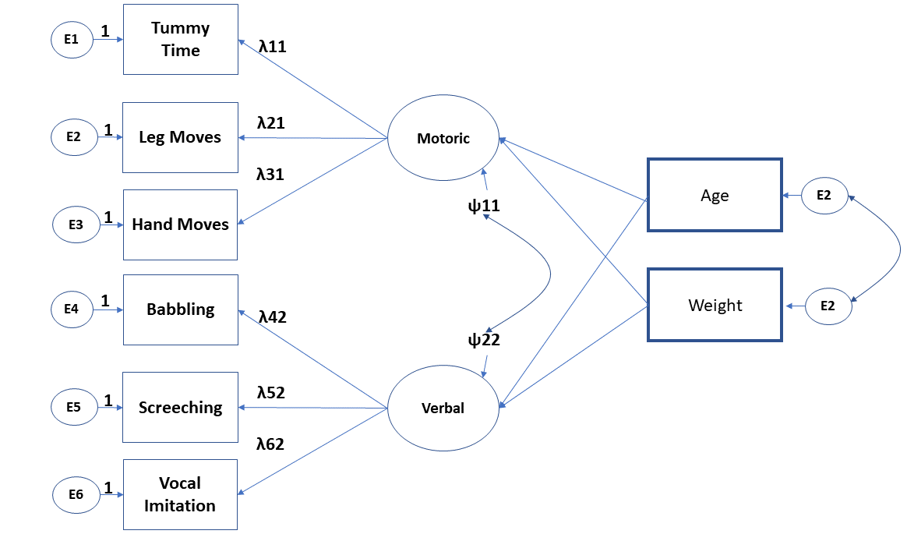

```{r setup, include=FALSE}
options(htmltools.dir.version = FALSE)
knitr::opts_chunk$set(
  fig.width=9, fig.height=3.5, fig.retina=3,
  out.width = "100%",
  cache = FALSE,
  echo = TRUE,
  message = FALSE, 
  warning = FALSE,
  hiline = TRUE
)
```

```{r xaringan-themer, include=FALSE, warning=FALSE}
library(xaringanthemer)
style_mono_accent(
  base_color = "#440099",
  header_font_google = google_font("Helvetica"),
  text_font_google   = google_font("Helvetica", "300", "300i"),
  code_font_google   = google_font("Fira Code"),
  code_font_size = '1.1rem',
  text_color = 'black',
  text_font_size = '24px',
  colors = c(red = "#f34213",
             green = "#136f63")
)
```

## Press record

---

## Intended learning goals <br/><br/>
Motivate utilisation of path and CFA models; Argue how they relate to other models that we covered  <br/><br/>
Calculate number of free parameters and degrees of freedom of the proposed model. <br/><br/>
Build a model in R statistical environment, estimate, and interpret the coefficients. <br/><br/>
Criticise, modify, compare, and evaluate the fit of the proposed models. <br/><br/>


---

## Latent space of measures

Principal Component Analysis (PCA) <br/><br/>
Exploratory Factor Analysis (EFA) <br/><br/>
Confirmatory Factor Analysis (CFA)

???
Differences between PCA and EFA:<br/><br/>
[Link 1](https://stats.stackexchange.com/a/95106)<br/><br/>
[Link 2](https://stats.stackexchange.com/a/288646)
---

## Exploratory factor analysis (EFA)

Multivariate statistical procedure (Spearman): understanding and accounting for variation and covariation among of set of observed variables by postulating __latent__ structures (factors)<br/><br/>

Factor: unobservable variable that influences more than one observed measure and accounts for their intercorrelation <br/><br/>

If we partial out latent construct then intercorrelations would be zero <br/><br/>

Factor analysis decomposes variance: __a) common variance (communality)__ and __b) unique variance__

???
Thourough example of EFA in R: https://psu-psychology.github.io/psy-597-SEM/06_factor_models/factor_models.html#overview
---

## EFA versus CFA

Reproduce observer relationships between measured variables with smaller number of latent factors <br/><br/>

EFA is data-driven approach: weak or no assumptions on a number of latent dimensions and factor loadings (relations between indicators and factors) <br/> <br/>

CFA is theory-driven approach: strong assumptions for both things <br/><br/>

EFA is used earlier in the process of questionnaire development and construct validation

---

## Factor model

```{r, echo=FALSE, out.width = '90%',fig.align='center'}
knitr::include_graphics("image1.png")
```

---

## Factor or measurement model

Is linear regression where the main predictor is latent or unobserved:   <br/>

$$y_1=\tau_1+\lambda_1*\eta+\epsilon_1$$<br/><br/>
$y_1=\tau_1+\lambda_1*\eta+\epsilon_1$<br/>
$y_2=\tau_2+\lambda_2*\eta+\epsilon_2$<br/>
$y_3=\tau_3+\lambda_3*\eta+\epsilon_3$<br/><br/>


$\tau$ - the item intercepts or means<br/>
$\lambda$ - factor loadings - regression coefficients  <br/>
$\epsilon$ - error variances and covariances  <br/>
$\eta$ - the latent predictor of the items<br/>
$\psi$ - factor variances and covariances  <br/>
---

## Exploratory factor model

```{r, echo=FALSE, out.width = '90%',fig.align='center'}

```

---

## Confirmatory factor model

```{r, echo=FALSE, out.width = '90%',fig.align='center'}
knitr::include_graphics("image3.png")
```

---

## Defining latent variables

LVs are not measured, however we can still infer them from the observed data. To be able to do so, we need to define their scale:

1. Marker variable: single factor loading constraint to 1 <br/><br/>
2. Standardized latent variables: setting variance of variable to 1  (Z-score) <br/><br/> 
3. Effects-coding: constraints that all of the loadings to one LV average 1.0 or that their sum is equal to number of indicators

???
https://www.researchgate.net/publication/255606342_A_Non-arbitrary_Method_of_Identifying_and_Scaling_Latent_Variables_in_SEM_and_MACS_Models
---
## Indicator variable and Standardizing LVs

```{r, echo=FALSE, out.width = '70%',fig.align='center'}
knitr::include_graphics("IndVar.png")
```

---

## Effect coding 

```{r, echo=FALSE, out.width = '40%',fig.align='center'}

```

---
## Identification of the CFA

```{r, echo=FALSE, echo=FALSE}
set.seed(456)
Babies=data.frame(Age=round(runif(100,1,30)), Weight=rnorm(100,4000,500))
Babies$Height=rnorm(100,40+0.2*Babies$Age+0.004*Babies$Weight, 5)
Babies$Gender=rbinom(100,1,0.5)
Babies$Crawl=rbinom(100,1,0.031*Babies$Age+0.00001*Babies$Weight-0.06*Babies$Gender)
Babies$TummySleep=rbinom(100,1,0.5)
Babies$PhysicalSt=rnorm(100,10+0.3*Babies$Height+0.1*Babies$Age-0.06*Babies$Gender+0.15*Babies$TummySleep,5)
Babies$Gender=as.factor(Babies$Gender)
levels(Babies$Gender)=c('Girls','Boys')
```

```{r, warning=FALSE, message=FALSE, echo=FALSE}
#install.packages('faux')
require(faux)
set.seed(456)

cmat <- c(1, .4,.4, .1, .1, .1,
          .4, 1,.3, .1, .1, .1,
          .4,.2, 1, .1, .1, .1,
          .1,.1,.1,  1, .4, .4,
          .1,.1,.1, .4,  1, .2,
          .1,.1,.1, .4, .2,  1)

vars<-rnorm_multi(n=100, 6,30,5,cmat)

names(vars)=c('TimeOnTummy','PreciseLegMoves','PreciseHandMoves','Babbling','Screeching','VocalImitation')

Babies=cbind(Babies,vars)
require(kableExtra)
```

Total number of parameters that we can estimate: $\frac{variables*(variables+1)}{2}$ <br/> <br/> <br/>

```{r}
Matrix<-cov(vars)
Matrix[upper.tri(Matrix)]<-NA
knitr::kable(Matrix, format = 'html', digits=2) %>%
  kable_styling(font_size = 9)
```

---

## Theory and previous results

Previous work in this area found that two __congeneric__ latent factors explain covariances of our six indicators: motoric and verbal latent component <br/><br/>

```{r, echo=FALSE, out.width = '65%',fig.align='center'}
knitr::include_graphics("image4.png")
```

---
## Estimated number of parameters

```{r, echo=FALSE, out.width = '50%',fig.align='center'}

```
--
Loadings $(\lambda)$: 4 parameters<br/><br/>
Residual variances $(\epsilon)$ : 6 parameters<br/><br/>
Factor variances and covariances $(\psi)$ : 3 parameters<br/><br/>
With intercepts: + 6 
---

## Coding of our model

```{r, message=FALSE, warning=FALSE}
#install.packages('lavaan')
require(lavaan)
model1<-'
motor =~ TimeOnTummy + PreciseLegMoves + PreciseHandMoves
verbal =~ Babbling + Screeching + VocalImitation
'

fit1<-cfa(model1, data=Babies)
```

```{css, echo=FALSE}
pre {
  max-height: 250px;
  overflow-y: auto;
}

pre[class] {
  max-height: 70px;
}
```

```{css, echo=FALSE}
.scroll-100 {
  max-height: 70px;
  overflow-y: auto;
  background-color: inherit;
}
```
---

## Results of the model

```{r}
summary(fit1)
```

---

## Results: visual


```{r, echo=FALSE, out.width = '90%',fig.align='center'}
knitr::include_graphics("image6.png")
```

---

## Interpretation of the coefficients: factor loadings

- When unstandardized and loaded on a single factor, then unstandardized regression coefficients. Model predicted difference in the predictor (measured variable) between groups that differ in 1-unit on the LVs <br/>  <br/>

- When loaded on multiple factors, then regression coefficients become contingent on other factors (check Lecture 1, slide 11)  <br/>  <br/>

- When standardized and loaded on a single factor (congeneric structure), then standardized loadings are estimated correlations between indicators and LVs <br/>  <br/>

- When standardized and loaded on a multiple factors, then same as the second option only standardized (beta weights)  <br/>

---

## Results of the model

```{r}
summary(fit1, standardized=TRUE)
```

---

## Scaling LVs: variance = 1 

```{r}
model2<-'
motor =~ NA*TimeOnTummy + PreciseLegMoves + PreciseHandMoves
verbal =~ NA*Babbling + Screeching + VocalImitation
motor ~~ 1*motor
verbal ~~ 1*verbal
'

fit2<-cfa(model2, data=Babies)
summary(fit2, standardized=TRUE)
```

---

## Scaling LVs: effect coding

```{r}
model3<-'
motor =~ NA*TimeOnTummy+a*TimeOnTummy + b*PreciseLegMoves + c*PreciseHandMoves
verbal =~ NA*Babbling+a1*Babbling + b1*Screeching + c1*VocalImitation
a+b+c==3
a1+b1+c1==3
'

fit3<-cfa(model3, data=Babies)
summary(fit3, standardized=TRUE)
```

---

## Adding intercepts

```{r}
model3<-'
motor =~ TimeOnTummy + PreciseLegMoves + PreciseHandMoves
verbal =~ Babbling + Screeching + VocalImitation
TimeOnTummy ~ 1
PreciseLegMoves ~ 1
PreciseHandMoves ~ 1
Babbling ~ 1
Screeching ~ 1 
VocalImitation ~ 1'
fit3<-cfa(model3, data=Babies)
summary(fit3, standardized=TRUE, fit.measures=T)
```

---

## Indices of global model fit

```{r}
summary(fit1, fit.measures=TRUE)
```

???
Measurement error in CFA: https://rdrr.io/cran/semTools/man/reliability.html
---
class: inverse, middle, center
# Structural equation model
---

## SEM, finally

```{r, echo=FALSE, out.width = '80%',fig.align='center'}

```

---

## Estimation of SEM

```{r}
model4<-'
#CFA model
motor =~ TimeOnTummy + PreciseLegMoves + PreciseHandMoves
verbal =~ Babbling + Screeching + VocalImitation

#Path model
motor ~ Age + Weight
verbal ~ Age + Weight
'

fit4<-sem(model4, data=Babies)
```
---
## Structural equation model: Results

```{r}
summary(fit4, standardized=TRUE)
```

---
class: inverse, middle, center
# Measurement invariance 
---

## Measurement invariance

Compare our model between the groups: <br/>
 - Configural invarience: Model fitted for each group separately<br/><br/>
 - Metric invariance: restriction of the factor loadings, but intercepts are allowed to vary <br/><br/>
 - Scalar invariance: restriction of the both, factor loadings and intercepts<br/><br/>
 - Strict invariance: restriction on factor loadings, intercepts and residual variances 


---

## Configural invariance

```{r, warning=FALSE, message=FALSE}
modelMI<-'
motor =~ TimeOnTummy + PreciseLegMoves + PreciseHandMoves
verbal =~ Babbling + Screeching + VocalImitation
'

fitMIC<-cfa(modelMI, data=Babies, group='Gender')
summary(fitMIC)
```

---

## Metric invariance: 1

```{r, warning=FALSE, message=FALSE}
modelMI<-'
motor =~ TimeOnTummy + PreciseLegMoves + PreciseHandMoves
verbal =~ Babbling + Screeching + VocalImitation
'

fitMIM<-cfa(modelMI, data=Babies, group='Gender',group.equal='loadings')
summary(fitMIM)
```

---

## Metric invariance: 2

```{r , warning=FALSE, message=FALSE}
#install.packages('semTools')
require(semTools)
summary(compareFit(fitMIC, fitMIM))
```

---

## Scalar invariance: 1

```{r , warning=FALSE, message=FALSE}
modelMI<-'
motor =~ TimeOnTummy + PreciseLegMoves + PreciseHandMoves
verbal =~ Babbling + Screeching + VocalImitation
'

fitMISc<-cfa(modelMI, data=Babies, group='Gender',group.equal=c('loadings','intercepts'))
summary(fitMISc)
```

---

## Scalar invariance: 2

```{r}
summary(compareFit(fitMIM,fitMISc))
```

---

## Strict invariance: 1

```{r}
modelMI<-'
motor =~ TimeOnTummy + PreciseLegMoves + PreciseHandMoves
verbal =~ Babbling + Screeching + VocalImitation
'

fitMISt<-cfa(modelMI, data=Babies, group='Gender',group.equal=c('loadings','intercepts','residuals'))
summary(fitMISt)
```

---

## Strict invariance: 2

```{r}
summary(compareFit(fitMISc,fitMISt))
```

---

## Where are the differences

```{r}
lavTestScore(fitMISc)
```

---
class: inverse, middle, center
# Practical aspect
---

## Theory and data

Holzinger and Swineford data (1939) - [LINK](https://www.rdocumentation.org/packages/psychTools/versions/2.0.8/topics/holzinger.swineford) <br/>

```{r, message=FALSE, warning=FALSE}
#install.packages('sem')
require(sem)
data('HS.data')
```

```{r, echo=FALSE, out.width = '55%',fig.align='center'}

```
---

## Model development 

```{r, echo=FALSE, out.width = '50%',fig.align='center'}

```

---

## Important aspects: theory 

- Understanding differences between Exploratory FA and Confirmatory FA <br/>
- How is linear model defined in the CFA<br/>
- Scaling of the latent variables <br/>
- Interpretation of the coefficients <br/>
- Number of free parameters versus total number of parameters <br/>

---

## Important aspects: practice

- Specifying and estimating CFA model <br/>
- Scaling the LVs by using marker variable or by scaling LVs variance to 1<br/>
- Adding intercepts to your CFA model <br/>
- Making a full SEM model <br/>

---

## Literature

Confirmatory Factor Analysis for Applied Research by Timothy A. Brown  <br/> <br/>

Chapters 9 of Principles and Practice of Structural Equation Modeling by Rex B. Kline <br/><br/> 


Latent Variable Modeling Using R: A Step-by-Step Guide by A. Alexander Beaujean <br/><br/>

---

## Thank you for your attention